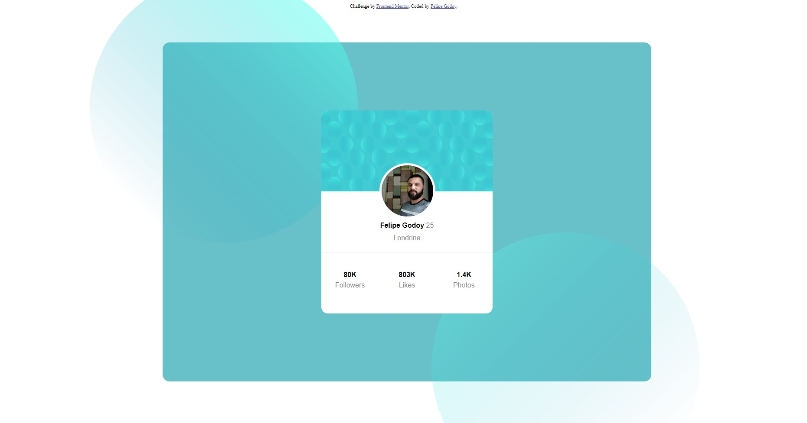

# Frontend Mentor - Profile card component solution

Essa é a resolução do [Desafio de Cartão Pessoal do Frontend Mentor](https://www.frontendmentor.io/challenges/profile-card-component-cfArpWshJ). 

## Sumário

- [Visão geral](#visao-geral)
  - [O desafio](#o-desafio)
  - [Screenshot](#screenshot)
  - [Links](#links)
- [Meu processo](#meu-processo)
  - [Construção](#construído-com)
  - [O que aprendi](#o-que-eu-aprendi)
  - [Continuação...](#continuação-do-desenvolvimento...)
  - [Recursos úteis](#recursos-úteis)
- [Autor](#autor)

## Visão geral

### O desafio

- Construir o projeto para ficar o mais próximo parecido do desafio proposto.

### Screenshot

### Links

- Projeto: [https://github.com/FelipeGodoy96/Profile-Card-Project](https://github.com/FelipeGodoy96/Profile-Card-Project)
- Site Online: [https://felipegodoy96.github.io/Profile-Card-Project/](https://felipegodoy96.github.io/Profile-Card-Project/)

## Meu processo

### Construído com:

- Semântica HTML5
- CSS
- Flexbox

### O que eu aprendi

Esse foi o meu primeiro desafio a desenvolver CSS com HTML sozinho, aprendi tanta coisa que se fosse descrever tudo essa página tomaria alguns dias meus.
	Porém, há alguns conceitos em destaque:
 - comportamentos de flexbox;
 - melhora de semântica HTML;
 - positions (absolute, relative, etc).

### Continuação do desenvolvimento...

Ainda que o projeto aparente finalizado,  há alguns detalhes que gostaria de corrigir.
O CSS ficou um pouco extenso, acredito que posso reduzi-lo, atribuindo classes mais abrangentes a caixas-filho ou caixas-pai.
O site não ficou responsivo para mobile, pretendo adicionar media queries para resolver esse problema. 
As bolhas não estão respeitando o limite do background azul.

### Recursos úteis

- [Guias de medida CSS](https://www.alura.com.br/artigos/guia-de-unidades-no-css?gclid=CjwKCAiAg6yRBhBNEiwAeVyL0DmCStoqs0eDAsFyXKq7eLZEtRvLvyfX-EljFelZN5M3mlbzkbkY3xoCuT8QAvD_BwE) - Esse guia me ajudou a entender conceitos importantes de positions, o que influenciou diretamente na concretização do projeto. O aprendido aqui será levado comigo por todo meu caminho em CSS's futuros.
- [Flexbox Froggy](https://flexboxfroggy.com) - Esse é um site incrível que me ajudou a entender as propriedades e comportamentos da Flexbox. Muito obrigado aos desenvolvedores por facilitar o entendimento da comunidade.
- [Medidas CSS](https://ishadeed.com/article/min-max-css/) - Um artigo que me ajudará a desenvolver o site com responsividade mobile.

## Autor

- GitHub - [Felipe Godoy](https://github.com/FelipeGodoy96)
- Frontend Mentor - [@FelipeGodoy96](https://www.frontendmentor.io/profile/FelipeGodoy96)

